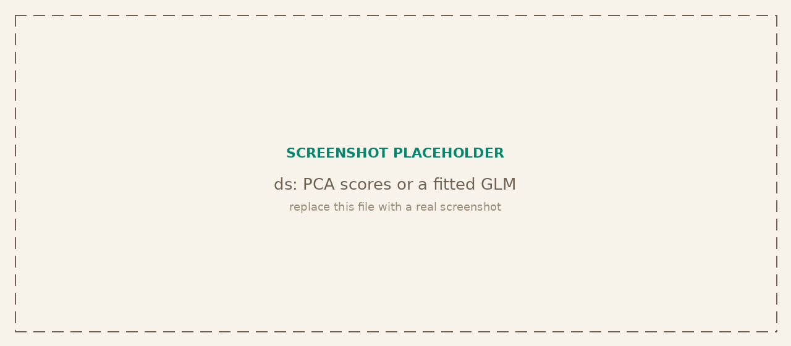

<p class="tg-pkg-head"><span class="tg-slug">tangent<span class="slash">/</span>ds</span> <span class="tg-validated">validated against statsmodels + scikit-learn</span></p>

A minimalist data-science toolkit that runs in the browser with no build step and no native dependencies. It bundles descriptive statistics, hypothesis tests, generalized linear models, multivariate analysis, and machine learning behind one API that reads like scikit-learn and R: estimators are objects you `fit` and then `transform` or `predict`, constructors take options objects, and functional helpers take plain numeric arrays.

```bash
npm install @tangent.to/ds       # npm
deno add jsr:@tangent/ds         # Deno / JSR
```

<a class="tg-run" href="https://note.tangent.to/gh/tangent-to/ds/examples/getting-started.js">
<svg width="15" height="15" viewBox="0 0 24 24" fill="none" stroke="currentColor" stroke-width="2" stroke-linecap="round" stroke-linejoin="round"><polygon points="5 3 19 12 5 21 5 3"/></svg>
Run the example notebook
</a>



## Namespaces

The default export is namespaced. Import the whole library (`import ds from '@tangent.to/ds'`) or pull a single namespace (`import { stats } from '@tangent.to/ds'`). Plotting helpers wrap [Observable Plot](https://observablehq.com/plot), which is an optional peer dependency: install `@observablehq/plot` only if you use `ds.plot`.

| Namespace | Capabilities |
| --- | --- |
| `ds.core` | Numeric primitives: math, linear algebra, tables, spatial helpers, formula parsing. |
| `ds.stats` | Distributions, hypothesis tests, correlation, ANOVA, and generalized linear models. |
| `ds.ml` | Preprocessing, KNN, decision trees, KMeans, MLP, cross-validation, and pipelines. |
| `ds.mva` | Multivariate analysis: PCA, LDA, RDA, CCA. |
| `ds.plot` | Observable Plot helpers for common statistical charts (optional peer dependency). |

## Statistics

`ds.stats` covers descriptive inference, the common hypothesis tests, and a generalized linear model. Tests report the statistic, p-value, degrees of freedom, and group summaries. The t-tests, one-way ANOVA, and distribution functions now match SciPy to machine precision.

| Signature | Description |
| --- | --- |
| `ds.stats.oneSampleTTest(x, mu, options?)` | One-sample t-test against a hypothesized mean. |
| `ds.stats.twoSampleTTest(a, b, options?)` | Independent two-sample t-test. Matches `ttest_ind`. |
| `ds.stats.pairedTTest(a, b, options?)` | Paired t-test on matched observations. |
| `ds.stats.oneWayAnova(groups, options?)` | One-way ANOVA across two or more groups. |
| `ds.stats.tukeyHSD(groups, options?)` | Tukey honest-significant-difference post-hoc comparisons. |
| `ds.stats.pearsonCorrelation(x, y)` | Pearson correlation with t-test and confidence interval. |
| `ds.stats.spearmanCorrelation(x, y)` | Spearman rank correlation. |
| `ds.stats.mannWhitneyU(a, b)` | Mann-Whitney U rank test. |
| `ds.stats.chiSquareTest(table)` | Chi-square test of independence. |
| `ds.stats.fisherExactTest(table)` | Fisher exact test for 2x2 tables. |
| `ds.stats.leveneTest(groups)` | Levene test for equality of variances. |
| `new ds.stats.GLM(options?)` | Generalized linear model (`fit`/`predict`), with formula syntax on table data. |
| `ds.stats.Distributions` | Density, cumulative, quantile, and sampling functions for the standard distributions. |

## Machine learning

`ds.ml` follows the scikit-learn pattern: construct an estimator with an options object, `fit` it, then `predict` or `transform`. Estimators accept either plain numeric matrices (Array API) or column selectors over row objects (Table API).

| Signature | Description |
| --- | --- |
| `new ds.ml.KMeans(options?)` | K-means clustering. `fit`, `predict`, cluster centers and inertia. |
| `new ds.ml.KNNClassifier(options?)` | K-nearest-neighbors classifier, e.g. `{ k: 3 }`. |
| `new ds.ml.KNNRegressor(options?)` | K-nearest-neighbors regressor. |
| `new ds.ml.DecisionTreeClassifier(options?)` | CART classification tree. |
| `new ds.ml.DecisionTreeRegressor(options?)` | CART regression tree. |
| `new ds.ml.MLPRegressor(options?)` | Multilayer-perceptron regressor. |
| `new ds.ml.preprocessing.StandardScaler()` | Standardize features to zero mean and unit variance (`fit`/`transform`). |
| `new ds.ml.preprocessing.MinMaxScaler()` | Scale features to a fixed range. |
| `new ds.ml.preprocessing.OneHotEncoder()` | One-hot encode categorical columns. |
| `ds.ml.validation.trainTestSplit(spec, options?)` | Split rows into train and test sets. |
| `ds.ml.validation.crossValidate(...)` | K-fold cross-validation, with `kFold` and `stratifiedKFold` helpers. |
| `ds.ml.recipe(spec)` | Chainable, inspectable preprocessing pipeline (`prep`/`bake`). |

## Multivariate analysis

`ds.mva` provides the classic ordination and discriminant methods as `fit`/`transform` estimators over numeric matrices or tables.

| Signature | Description |
| --- | --- |
| `new ds.mva.PCA(options?)` | Principal component analysis. Scores, loadings, and explained variance. |
| `new ds.mva.LDA(options?)` | Linear discriminant analysis for supervised separation. |
| `new ds.mva.RDA(options?)` | Redundancy analysis (constrained ordination). |
| `new ds.mva.CCA(options?)` | Canonical correlation analysis. |

## Data and math

`ds.core` holds the numeric layer the rest of the library builds on.

| Signature | Description |
| --- | --- |
| `ds.core.math` | Descriptive primitives: `mean`, `variance` (sample by default), `stddev`, quantiles, and more. |
| `ds.core.linalg` | Linear algebra: matrix products, decompositions, and solves. |
| `ds.core.table` | Column-oriented table helpers for structured row data. |
| `ds.core.spatial` | Distance and spatial utilities. |
| `ds.core.parseFormula(formula)` | Parse an R-style model formula for use with GLM and estimators. |

## Verified against statsmodels + scikit-learn

The comparison suite checks ds against reference implementations on shared problems: the t-tests, one-way ANOVA, and distribution functions match SciPy to machine precision, correlations and GLM fits agree with statsmodels, and the estimators reproduce scikit-learn on the same inputs. Where a method has a natural R analogue (Tukey HSD, the multivariate ordinations) the results are checked against R as well.
