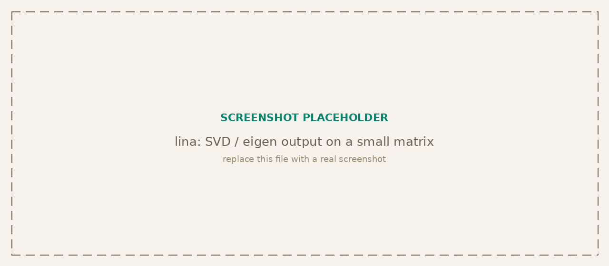

<p class="tg-pkg-head"><span class="tg-slug">tangent<span class="slash">/</span>lina</span> <span class="tg-validated">validated against numpy / scipy.linalg</span></p>

Dense linear algebra on plain JavaScript arrays: solving systems, the standard factorizations (LU, QR, Cholesky, SVD, symmetric eigendecomposition), the generalized symmetric eigenproblem, least squares, and the everyday matrix operations. Matrices are nested arrays (`number[][]`) and vectors are flat arrays (`number[]`); flat `Float64Array` storage is used internally for the numerics.

```bash
npm install @tangent.to/lina      # npm
deno add jsr:@tangent/lina         # Deno / JSR
```

<a class="tg-run" href="https://note.tangent.to/gh/tangent-to/lina/examples/linear-algebra.js">
<svg width="15" height="15" viewBox="0 0 24 24" fill="none" stroke="currentColor" stroke-width="2" stroke-linecap="round" stroke-linejoin="round"><polygon points="5 3 19 12 5 21 5 3"/></svg>
Run the example notebook
</a>

<!-- Placeholder screenshot hidden until a real one is ready:

-->

## Solving systems

Direct solves for square systems, plus the least-squares and pseudo-inverse routes for over- or under-determined ones.

| Signature | Description |
| --- | --- |
| `solve(A, b)` | Solve `A x = b` for a square `A` via LU with partial pivoting. |
| `lstsq(A, b)` | Least-squares solution of `A x = b`. Returns `{x, residualNorm}`. |
| `pinvSolve(A, b)` | Minimum-norm least-squares solution through the pseudo-inverse (SVD). |

## Factorizations

| Signature | Description |
| --- | --- |
| `lu(A)` | LU decomposition with partial pivoting. Returns `{L, U, P}`. |
| `qr(A)` | QR decomposition. Returns `{Q, R}`. |
| `cholesky(A)` | Cholesky factor of a symmetric positive-definite `A`. |
| `choleskySolve(L, b)` | Solve `A x = b` from `A`'s Cholesky factor `L`. `b` is a vector, or a matrix whose columns are right-hand sides — passing them all at once is much cheaper than one call per column. |
| `svd(A)` | Singular value decomposition. Returns `{U, s, V}` with singular values `s`. |
| `eigSym(A)` | Eigendecomposition of a symmetric `A`. Returns `{values, vectors}`. |

## Generalized eigenproblem

Discriminant analysis, canonical correlation and related methods do not ask for the eigenvectors of a single matrix but for those of one matrix *relative to another*: `A x = λ B x`, with `A` symmetric and `B` a symmetric positive (semi)definite scatter or covariance matrix.

| Signature | Description |
| --- | --- |
| `eigSymGeneralized(A, B)` | Solve `A x = λ B x`. Returns `{values, vectors, definite}`, values descending. |
| `invSqrtSym(A)` | Inverse square root of a symmetric positive semidefinite `A`, with null directions dropped. |

```javascript
import { eigSymGeneralized } from '@tangent.to/lina';

// Discriminant axes: between-class scatter relative to within-class scatter
const { values, vectors, definite } = eigSymGeneralized(Sb, Sw);
```

When `B` is positive definite the solver uses the Cholesky reduction and returns **B-orthonormal** eigenvectors (`xᵀ B x = 1`), the same normalization as `scipy.linalg.eigh(A, B)`.

When `B` is singular, scipy raises. lina instead falls back to `B`'s truncated inverse square root and solves the problem projected onto the range of `B`, `P A x = λ B x` — the most that is defined, since off that range the equation generally has no solution at all. Directions in the null space come back as zero eigenvectors, and the remaining vectors carry unit euclidean length rather than B-orthonormality. The returned `definite` flag says which route ran; pass `{ strict: true }` to get scipy's behaviour and throw instead.

This is not an edge case in practice: small discriminant designs routinely leave the within-class scatter exactly singular, which is why the fallback exists rather than a hard failure.

## Matrix operations

| Signature | Description |
| --- | --- |
| `matmul(A, B)` | Matrix product `A B`. |
| `transpose(A)` | Matrix transpose. |
| `inv(A)` | Inverse of a square `A`. |
| `det(A)` | Determinant. |
| `identity(n)` | `n`-by-`n` identity matrix. |
| `diag(v)` | Diagonal matrix from a vector (or the diagonal of a matrix). |
| `norm(x, ord?)` | Vector or matrix norm. |
| `trace(A)` | Sum of the diagonal entries. |

## Properties

| Signature | Description |
| --- | --- |
| `rank(A)` | Numerical rank from the singular values. |
| `cond(A)` | Condition number (ratio of largest to smallest singular value). |
| `isPositiveDefinite(A)` | Tests symmetric positive-definiteness via an attempted Cholesky. |

## Verified against numpy

The comparison suite runs each routine against `numpy` and `scipy.linalg` on shared matrices: `solve` and `lstsq` match to tolerance, the factorizations reconstruct their inputs (`Q R`, `L U`, `U diag(s) Vᵀ`) and satisfy their defining properties, and `eigSym` recovers the same values and vectors up to sign and ordering. `eigSymGeneralized` matches `scipy.linalg.eigh(A, B)` on eigenvalues, residual and B-orthonormality, and `invSqrtSym` matches `fractional_matrix_power(A, -1/2)`. `cond` and `rank` agree on the singular-value spectrum.
