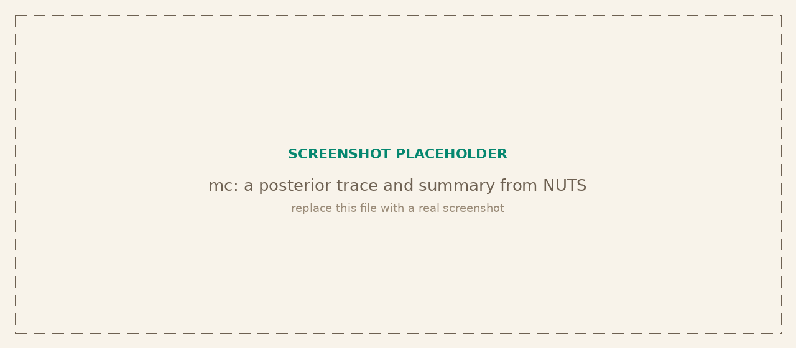

<p class="tg-pkg-head"><span class="tg-slug">tangent<span class="slash">/</span>mc</span> <span class="tg-validated">validated against PyMC</span></p>

Bayesian modeling the way PyMC does it: declare priors and a likelihood as a directed acyclic graph of random variables, then draw from the posterior with Markov chain Monte Carlo.

```bash
npm install @tangent.to/mc       # npm
deno add jsr:@tangent/mc         # Deno / JSR
```

<a class="tg-run" href="https://note.tangent.to/gh/tangent-to/mc/examples/bayesian-inference.js">
<svg width="15" height="15" viewBox="0 0 24 24" fill="none" stroke="currentColor" stroke-width="2" stroke-linecap="round" stroke-linejoin="round"><polygon points="5 3 19 12 5 21 5 3"/></svg>
Run the example notebook
</a>

<!-- Placeholder screenshot hidden until a real one is ready:

-->

## Building a model

A `Model` is a container of named random variables. Add priors with `addVariable`, attach a likelihood or factor with `potential` or `autoPotential`, and record post-hoc transforms with `deterministic`. All of them return the model, so calls chain.

| Signature | Description |
| --- | --- |
| `new Model(name?)` | Create a model. Accepts a name string or `{ name }`. |
| `model.addVariable(name, dist, observed?)` | Register a random variable under a prior distribution. |
| `model.potential(name, fn, gradFn?)` | Add a log-density factor. `fn(params)` returns the term's log density as a number. Without a `gradFn` the term falls back to central finite differences. |
| `model.autoPotential(name, fn, options?)` | The same term written in [grad](/grad/) operations and differentiated exactly. See [Exact gradients](#exact-gradients). |
| `model.deterministic(name, fn)` | Record a named transform of the parameters in the trace. It receives plain numbers after sampling and does not affect the log probability, so it is not the place to build a model expression. |
| `model.logProb(params)` | Evaluate the unnormalized joint log probability at a point. |

## Distributions

The distribution classes back both priors and likelihoods. Each constructor takes positional parameters or a single options object, matching the tangent convention. Call `.logProb(x)` for the log density and `.sample(n)` to draw.

| Signature | Description |
| --- | --- |
| `new Normal(mu, sigma)` | Normal, also `{ mu \| mean, sigma \| sd \| std }`. |
| `new Uniform(lower, upper)` | Uniform, also `{ lower \| min, upper \| max }`. |
| `new Bernoulli(p)` | Bernoulli, also `{ p }`. |
| `new Beta(alpha, beta)` | Beta, also `{ alpha, beta }`. |
| `new Gamma(alpha, beta)` | Gamma parameterized by shape and RATE, also `{ alpha \| shape, beta \| rate }`. Passing a `scale` key throws (use `rate = 1/scale`). |
| `new Lognormal(mu, sigma)` | Lognormal, also `{ mu \| mean, sigma \| sd \| std }`. |
| `new HalfNormal(sigma)` | Half-normal on the positive line, also `{ sigma \| sd \| std \| scale }`. |

## Samplers

Every sampler exposes `sample(model, initialValues, options)`, where `options` is `{ nSamples, nWarmup, thin }` (Metropolis and HMC use `burnIn` as the warmup key; NUTS accepts either `nWarmup` or `burnIn`). The call returns a trace keyed by variable name plus run diagnostics. NUTS is the recommended default.

| Signature | Description |
| --- | --- |
| `new NUTS(options?)` | No-U-Turn Sampler, e.g. `{ stepSize, targetAcceptance }`. Tunes trajectory length and adapts step size by dual averaging. Recommended. |
| `new HamiltonianMC(stepSize?, nSteps?)` | Hamiltonian Monte Carlo with a fixed number of leapfrog steps. |
| `new MetropolisHastings(proposalStd?)` | Random-walk Metropolis-Hastings. Gradient-free baseline. |
| `new HMC(...)` | Vector-valued Hamiltonian sampler for models expressed over a single parameter vector. |
| `sampler.sample(model, init, options?)` | Draw from the posterior. Returns `{ trace, acceptanceRate, stepSize, ... }`. |

## Exact gradients

A gradient-based sampler needs the gradient of the joint log probability. Priors are differentiated analytically from [proba](/proba/), and a term added with `potential` falls back to central finite differences: `2·P` extra evaluations of the whole term per gradient, accurate to about `1e-7`, which is enough error to cost the leapfrog integrator its symplectic property.

`autoPotential` avoids both costs. The term is written as an expression in [grad](/grad/) operations and differentiated by reverse-mode autodiff, at one evaluation per gradient regardless of the parameter count, and to about `1e-13` against a hand-derived closed form.

```js
model.autoPotential('y', (v) => {
  const mu = add(v.intercept, mul(v.slope, xData), seasonOffset);
  const z = div(sub(yData, mu), v.sigma);
  return sub(mul(-0.5, sum(square(z))), mul(yData.length, log(v.sigma)));
});
```

The tape is compiled by default: built once and replayed at each new set of parameters rather than reconstructed on every call. That is worth roughly a factor of three on a real fit. It is safe as a default because of the contract the method already states. The term is an expression built from grad's operations, which fixes its graph by construction, and a sampler holds every parameter's shape constant for the length of a run. The two ways to break that assumption both mean writing something that is not such an expression, namely branching on a parameter's numeric value by reaching into `.data`, or closing over data that is mutated while the sampler runs. Pass `{ compile: false }` for those.

## Parallel chains

Chains are independent by construction, but `sampler.sample()` runs them one after another. `sampleChains` gives each chain its own worker, in the browser, in Deno and in Node, so four chains cost roughly one chain of wall-clock time.

A worker cannot receive a live closure, so the model arrives as a self-contained factory whose source is sent across and re-evaluated there, together with a structured-clonable `data` object. The factory sees its two arguments and nothing else: anything it needs travels in `data`, and grad's operations arrive as `mc.ops`, since an import at the top of your module is exactly what a worker cannot see.

```js
const fit = await sampleChains((data, mc) => {
  const { add, div, log, mul, square, sub, sum } = mc.ops;
  const model = new mc.Model('lin');
  model.addVariable('a', new mc.distributions.Normal(0, 5));
  model.addVariable('logSig', new mc.distributions.Normal(0, 1));
  model.autoPotential('lik', (v) => { /* ... written in those ops ... */ });
  return model;
}, { data, chains: 4, inits, nSamples: 400, nWarmup: 400, seed: 20240115 });

fit.byChain.a   // [[chain-0 draws], [chain-1 draws], ...], ready for gelmanRubin
fit.trace.a     // the chains pooled
```

Each chain derives its own seed from `seed`, so a run is reproducible, and `{ parallel: false }` runs the same chains in process from the same seeds and the same factory source, producing identical draws. On a 340-observation model with 15 parameters, four chains of 400 draws after 400 warmup take 19.5 seconds in series and 5.7 seconds across four workers.

## Diagnostics

The diagnostics namespace summarizes and audits a trace after sampling.

| Signature | Description |
| --- | --- |
| `summarize(draws)` | Reduce a column of draws to mean, std, and a 95 percent credible interval (`hdi_2_5` to `hdi_97_5`). |
| `effectiveSampleSize(draws)` | Effective sample size accounting for autocorrelation. |
| `gelmanRubin(chains)` | Gelman-Rubin R-hat convergence statistic across chains. |
| `printSummary(trace)` | Print a formatted posterior summary table. |
| `traceToJSON(trace)` / `traceToCSV(trace)` | Serialize a trace for storage or external tools. |

## Reproducibility

Every sampler and every `.sample()` call draws from a single RNG stream. Seed it once for a fully reproducible run across machines.

`sampleChains` is the exception, and deliberately so: it seeds each chain independently from its own `seed` option rather than sharing one stream, since a worker has no access to the parent's. That is what R-hat assumes anyway, and it means a parallel run is reproducible from its own seed without depending on how much randomness the cells above it happened to consume.

| Signature | Description |
| --- | --- |
| `setRandomSeed(seed)` | Seed the shared RNG stream. |
| `getRng()` | Access the shared random-number generator. |

## Verified against PyMC

mc is browser-first and PyMC-like: the modeling API (priors, a likelihood, `Model`) mirrors PyMC, and the samplers reproduce PyMC's behavior on shared problems. On the estimate-a-mean example NUTS recovers the true value with a credible interval that brackets it, acceptance adapts to the 0.8 target, and the analytic gradients let the whole run happen in the browser.
