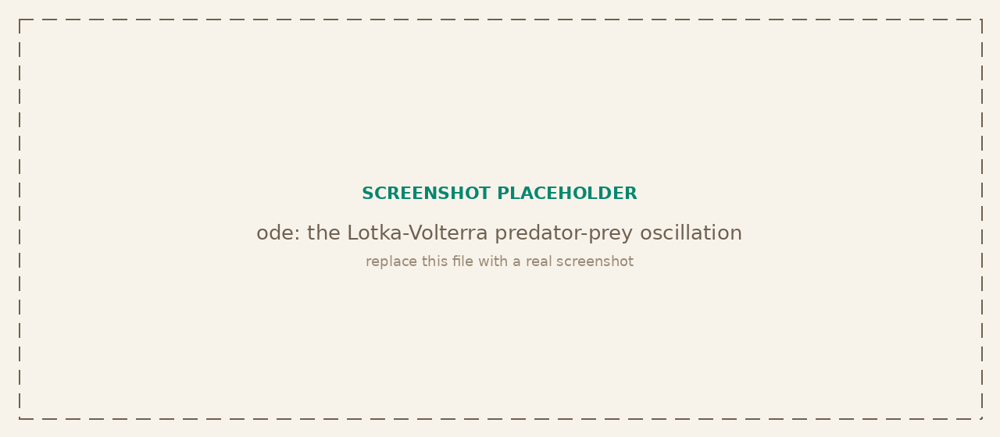

<p class="tg-pkg-head"><span class="tg-slug">tangent<span class="slash">/</span>ode</span> <span class="tg-validated">validated against scipy.integrate</span></p>

Initial value problems `y' = f(t, y)` with plain-array (or scalar) state. Adaptive Dormand-Prince RK45 with dense output and event detection for non-stiff systems, an adaptive Rosenbrock method for stiff ones, and the classic fixed-step integrators. PDEs are handled by the method of lines: discretize space yourself and hand the resulting ODE system to a solver.

```bash
npm install @tangent.to/ode        # npm
deno add jsr:@tangent/ode           # Deno / JSR
```

<a class="tg-run" href="https://note.tangent.to/gh/tangent-to/ode/examples/lotka-volterra.js">
<svg width="15" height="15" viewBox="0 0 24 24" fill="none" stroke="currentColor" stroke-width="2" stroke-linecap="round" stroke-linejoin="round"><polygon points="5 3 19 12 5 21 5 3"/></svg>
Run the example notebook
</a>

<!-- Placeholder screenshot hidden until a real one is ready:

-->

## Non-stiff integration

The result is `{t, y, success, nfev, nsteps}` with `y` component-major: `y[i]` is the trajectory of state component `i` over the reported times `t`.

| Signature | Description |
| --- | --- |
| `rk45(f, tSpan, y0, options?)` | Adaptive Dormand-Prince RK45: a 5th-order step with an embedded 4th-order error estimate, PI step-size control, and a dense-output interpolant. |
| `solve(f, tSpan, y0, options?)` | Dispatcher over every method (scipy `solve_ivp` style). Defaults to `rk45`; select another with `options.method`. |

Here `f` is `(t, y) => dydt`, `tSpan` is `[t0, tEnd]` (backward integration allowed when `tEnd < t0`), and `y0` is a `number[]` or a scalar.

## Stiff systems

| Signature | Description |
| --- | --- |
| `rosenbrock(f, tSpan, y0, options?)` | Adaptive Rosenbrock method for stiff systems, where an explicit method would be forced into vanishingly small steps. |

## Fixed step

Non-adaptive integrators for when a fixed grid is wanted. Same call shape; use `options.step` (or `tEval`) to set the grid.

| Signature | Description |
| --- | --- |
| `euler(f, tSpan, y0, options?)` | Explicit (forward) Euler, 1st order. |
| `rk2(f, tSpan, y0, options?)` | 2nd-order Runge-Kutta (midpoint). |
| `rk4(f, tSpan, y0, options?)` | Classic 4th-order Runge-Kutta. |

## Options

Passed as the `options` object to any adaptive solver.

| Option | Description |
| --- | --- |
| `rtol` | Relative tolerance (default `1e-6`). |
| `atol` | Absolute tolerance (default `1e-9`). |
| `tEval` | Times at which to report the solution, via the dense-output interpolant. |
| `events` | `g(t, y) => number` (or an array of them); each sign change is bracketed and its root reported in `events`. |
| `maxStep` | Largest allowed step size. |
| `firstStep` | Initial step size (chosen automatically if omitted). |
| `maxSteps` | Safety cap on accepted plus rejected steps. |

## Verified against scipy

The comparison suite integrates shared problems against `scipy.integrate`: `rk45` tracks `solve_ivp` with `RK45` to tolerance on non-stiff systems, `rosenbrock` holds accuracy on stiff ones where fixed-step methods diverge, and event roots and dense-output samples land on the reference trajectory. The Lotka-Volterra orbit closes on itself over a period, the standard check that the adaptive controller is conserving the invariant.
