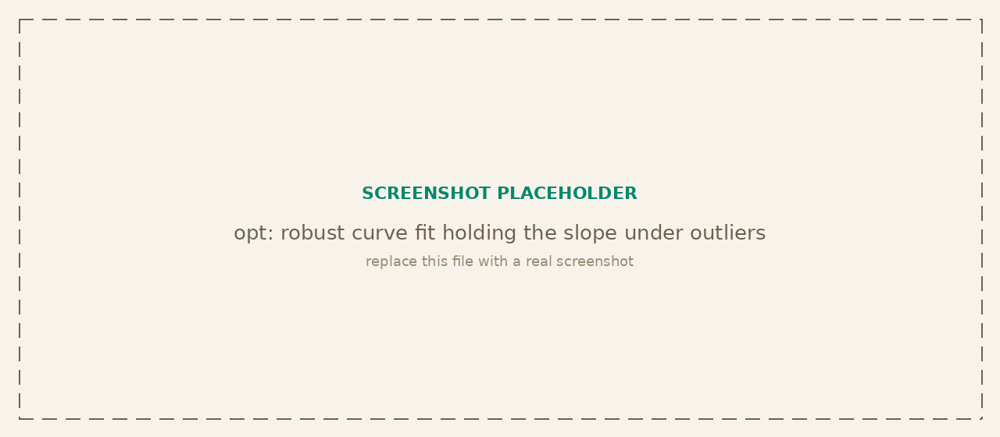

<p class="tg-pkg-head"><span class="tg-slug">tangent<span class="slash">/</span>opt</span> <span class="tg-validated">validated against scipy.optimize</span></p>

Numerical optimization: function minimization, curve fitting, and root finding. Derivative-free and gradient-based methods share one declarative interface, and gradients are optional (supply them, return them from the objective, or let finite differences fill in).

```bash
npm install @tangent.to/opt      # npm
deno add jsr:@tangent/opt        # Deno / JSR
```

<a class="tg-run" href="https://note.tangent.to/gh/tangent-to/opt/examples/optimization.js">
<svg width="15" height="15" viewBox="0 0 24 24" fill="none" stroke="currentColor" stroke-width="2" stroke-linecap="round" stroke-linejoin="round"><polygon points="5 3 19 12 5 21 5 3"/></svg>
Run the example notebook
</a>



## Minimization

The declarative entry point takes a single spec object and dispatches by method. L-BFGS is the default for smooth problems; Nelder-Mead needs no gradient.

| Signature | Description |
| --- | --- |
| `minimize({ f, x0, method, grad?, bounds? })` | Minimize a scalar function of several variables. Returns `{ x, fx, converged, nfev, iterations }`. |
| `lbfgs(f, x0, options?)` | Limited-memory quasi-Newton with a strong-Wolfe line search. |
| `nelderMead(f, x0, options?)` | Derivative-free downhill simplex. |
| `gradientDescent(f, x0, options?)` | Gradient descent with optional backtracking line search. |
| `adam(f, x0, options?)` | Adam, for stochastic or noisy objectives. |
| `methods()` | List the available method names. |

## Scalar problems

| Signature | Description |
| --- | --- |
| `minimizeScalar(f, options?)` | Brent minimization on a one-dimensional function, with automatic bracketing. |
| `rootScalar(f, options?)` | Brent-Dekker root finding on a bracketed sign change. |

## Curve fitting and least squares

| Signature | Description |
| --- | --- |
| `curveFit({ f, xdata, ydata, p0, bounds?, loss? })` | Fit a model to data. Returns parameters, covariance and standard errors. Robust losses (`huber`, `soft_l1`, `cauchy`) resist outliers. |
| `leastSquares({ residual, x0, jac?, bounds? })` | Nonlinear least squares (Levenberg-Marquardt). |

## Gradients and bounds

| Signature | Description |
| --- | --- |
| `numericalGradient(f, x, h?)` | Central finite-difference gradient. |
| `numericalJacobian(f, x, h?)` | Central finite-difference Jacobian. |
| `numericalHessian(f, x, h?)` | Central finite-difference Hessian. |
| `makeBoundsTransform(bounds)` | Box-bounds transform shared by every method. |

## Verified against scipy

The comparison suite runs every method against `scipy.optimize` on shared problems: L-BFGS matches `L-BFGS-B` to within its own tolerance, `curveFit` recovers parameters and standard errors that agree with `curve_fit`, and `rootScalar` matches `brentq` to machine precision. Under three gross outliers a plain fit's slope collapses while the Huber-robust fit holds it near the true value.
