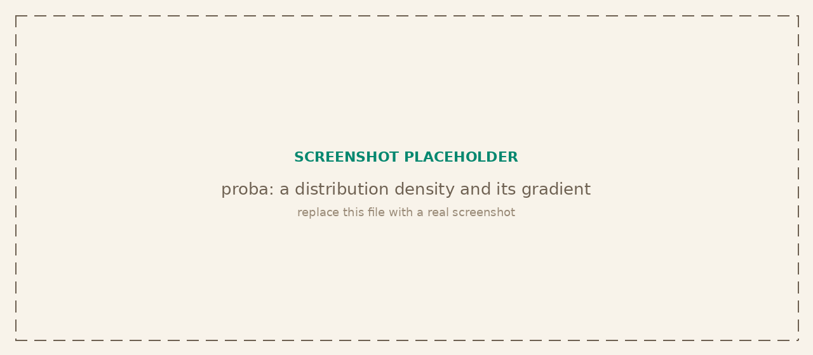

<p class="tg-pkg-head"><span class="tg-slug">tangent<span class="slash">/</span>proba</span> <span class="tg-validated">validated against scipy.stats</span></p>

Probability distributions with a single frozen-object interface: log density, density, CDF, quantile, seedable sampling, and moments. Every continuous distribution also carries an analytic `dlogpdf`, the exact gradient of its log density, which is what gradient-based inference (HMC, NUTS, variational methods) consumes instead of finite differences.

```bash
npm install @tangent.to/proba    # npm
deno add jsr:@tangent/proba       # Deno / JSR
```

<a class="tg-run" href="https://note.tangent.to/gh/tangent-to/proba/examples/distributions.js">
<svg width="15" height="15" viewBox="0 0 24 24" fill="none" stroke="currentColor" stroke-width="2" stroke-linecap="round" stroke-linejoin="round"><polygon points="5 3 19 12 5 21 5 3"/></svg>
Run the example notebook
</a>

<!-- Placeholder screenshot hidden until a real one is ready:

-->

## The distribution interface

Every distribution is a frozen object exposing the same methods. `params` is a plain object keyed by the distribution's canonical parameter names. `logpdf` is the source of truth; `pdf` is its exponential.

| Signature | Description |
| --- | --- |
| `logpdf(x, params)` | Log density (log pmf for discrete). Returns `-Infinity` outside the support, never `NaN`. |
| `pdf(x, params)` | Density, `exp(logpdf)`. May underflow to `0`. |
| `cdf(x, params)` | Cumulative probability `P(X <= x)`. |
| `quantile(p, params)` | Inverse CDF for `p` in `[0, 1]`. Discrete: smallest `k` with `cdf(k) >= p`. |
| `dlogpdf(x, params)` | Analytic gradient of `logpdf`. Continuous returns `{dx, ...d<param>}`; discrete returns `{...d<param>}`. |
| `logDensity(x, params)` | The same log density as a [grad](/grad/) expression: `x` and any parameter may be a `Var`. Elementwise, shaped like `x`; the support is not checked. See [On the tape](#on-the-tape). |
| `sample(params, rng)` | One draw using an `rng` from `createRng`. |
| `sampleN(params, rng, n)` | Array of `n` draws. |
| `mean(params)` | Distribution mean (`NaN` where undefined). |
| `variance(params)` | Distribution variance. |
| `support(params)` | `[min, max]` bounds of the support. |
| `validate(params)` | Throws on invalid parameters. Call at model-build time. |

## Distributions

Thirteen distributions, keyed by name in the `distributions` registry for dynamic lookup. Parameterizations follow the Bayesian-textbook convention (as in PyMC and Stan), not scipy's loc/scale.

| Distribution | Parameters | Kind |
| --- | --- | --- |
| `normal` | `{mu, sigma}` | continuous |
| `uniform` | `{low, high}` | continuous |
| `exponential` | `{lambda}` (rate) | continuous |
| `lognormal` | `{mu, sigma}` (log-scale) | continuous |
| `halfnormal` | `{sigma}` | continuous |
| `gamma` | `{alpha, beta}` (shape, rate) | continuous |
| `beta` | `{alpha, beta}` | continuous |
| `studentT` | `{nu, mu, sigma}` | continuous |
| `chi2` | `{k}` | continuous |
| `f` | `{d1, d2}` | continuous |
| `bernoulli` | `{p}` | discrete |
| `binomial` | `{n, p}` | discrete |
| `poisson` | `{lambda}` (rate) | discrete |

## Analytic gradients

The differentiator: `dlogpdf` returns exact derivatives, not finite differences. Names are `d` plus the parameter name, plus `dx` for continuous distributions. They match `numericalGradient` of `logpdf` to roughly `1e-6` (tested), and are what downstream samplers differentiate through.

| Signature | Description |
| --- | --- |
| `normal.dlogpdf(x, {mu, sigma})` | Returns `{dx, dmu, dsigma}`. |
| `gamma.dlogpdf(x, {alpha, beta})` | Returns `{dx, dalpha, dbeta}`. |
| `bernoulli.dlogpdf(x, {p})` | Discrete: returns `{dp}` (no `dx`). |

## On the tape

Since 0.2 every distribution also carries `logDensity`, the log density written in grad's operations, one function per distribution in `src/density.js`. Where `logpdf` takes numbers and branches on the support, `logDensity` takes `Var`s and does not: a branch on a `Var` is not differentiable, a sampler keeps its values inside the support by construction, and an observed value is data the caller validated. It is elementwise, so the caller reduces with `sum` or `mean`, or weights the rows first.

```js
import { normal, poisson } from '@tangent.to/proba';
import { compile, exp, mean, neg } from '@tangent.to/grad';

const nll = compile((p, d) =>
  neg(mean(normal.logDensity(d.y, { mu: p.mu, sigma: exp(p.logSigma) }))));
nll({ mu: 0.2, logSigma: 0 }, { y: data });      // { value, gradient }
poisson.logDensity(counts, { lambda: exp(logRate) });
```

Inside the support, on plain numbers, `logDensity` agrees with `logpdf`, and its gradients through grad agree with `dlogpdf` in `x` and in every parameter; both are tested. [mc](/mc/) derives its observation models from it, [nn](/nn/) its likelihood losses, so each formula has one copy in the suite. proba depends on grad for this.

## Sampling

Sampling is seedable and reproducible: build one `rng` and thread it through every draw.

| Signature | Description |
| --- | --- |
| `createRng(seed?)` | Seedable pseudo-random generator, passed to `sample` and `sampleN`. |
| `dist.sample(params, rng)` | One draw from `dist`. |
| `dist.sampleN(params, rng, n)` | Array of `n` independent draws. |

## Special functions

The `special` namespace holds the numerics that the CDFs and quantiles route through. They are exported for direct use.

| Signature | Description |
| --- | --- |
| `special.lgamma(x)` | Log of the absolute gamma function, `ln|Γ(x)|` (Lanczos). |
| `special.digamma(x)` | Digamma `ψ(x) = d/dx ln Γ(x)`. |
| `special.gammainc(a, x)` | Regularized lower incomplete gamma `P(a, x)`. |
| `special.gammaincc(a, x)` | Regularized upper incomplete gamma `Q(a, x)`. |
| `special.gammaincInv(p, a)` | Inverse of `gammainc` in `x`. |
| `special.betainc(a, b, x)` | Regularized incomplete beta `I_x(a, b)`. |
| `special.betaincInv(p, a, b)` | Inverse of `betainc` in `x`. |
| `special.erf(x)` / `special.erfc(x)` | Error function and its complement. |
| `special.normalCdf(x)` / `special.normalQuantile(p)` | Standard normal CDF and its inverse (probit). |
| `special.lbeta(a, b)` / `special.lchoose(n, k)` | Log beta function and log binomial coefficient. |

## Verified against scipy

The comparison suite checks `logpdf`, `cdf`, and `quantile` for every distribution against `scipy.stats` across each parameter range, mapping the tangent parameterization to scipy's loc/scale per distribution. The special functions hold to roughly `1e-12`. Each `dlogpdf` is checked against a finite-difference gradient of the corresponding `logpdf` to confirm the analytic derivatives are exact.
