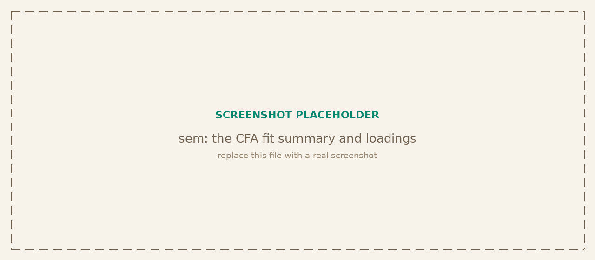

<p class="tg-pkg-head"><span class="tg-slug">tangent<span class="slash">/</span>sem</span> <span class="tg-validated">validated against lavaan (via semopy)</span></p>

Structural equation modeling: confirmatory factor analysis, path analysis, and full SEM. You write lavaan-style model syntax, sem estimates by maximum likelihood, and it reports the same fit indices and parameter estimates you would get from R's lavaan. It is the first maintained SEM implementation in JavaScript, built on the tangent suite's numeric leaves (lina for linear algebra, opt for L-BFGS, proba for the test distributions).

```bash
npm install @tangent.to/sem      # npm
deno add jsr:@tangent/sem        # Deno / JSR
```

<a class="tg-run" href="https://note.tangent.to/gh/tangent-to/sem/examples/cfa.js">
<svg width="15" height="15" viewBox="0 0 24 24" fill="none" stroke="currentColor" stroke-width="2" stroke-linecap="round" stroke-linejoin="round"><polygon points="5 3 19 12 5 21 5 3"/></svg>
Run the example notebook
</a>



## Fitting a model

`sem` takes a model-syntax string and a spec. Pass either raw rows (`{ data }`) or a precomputed covariance (`{ cov, n, names }`). It returns `{ estimates, fit, summary() }` plus the implied and sample covariance matrices and a `converged` flag. `cfa` is an alias for the same engine that reads better when the model is a pure measurement model.

| Signature | Description |
| --- | --- |
| `sem(syntax, { data })` | Fit from row objects (one property per observed variable). Computes the sample covariance internally. |
| `sem(syntax, { cov, n, names })` | Fit from a sample covariance matrix with its sample size and variable names. |
| `cfa(syntax, spec)` | Alias for `sem`, for confirmatory factor analysis. |

## Model syntax

The syntax follows lavaan. One relation per line; variables named on the left and right refer to columns in the data (or names in `cov`).

| Operator | Meaning |
| --- | --- |
| `factor =~ ind1 + ind2` | Measurement: the latent factor is measured by these indicators (loadings). |
| `y ~ x1 + x2` | Regression: `y` is regressed on the predictors (structural paths). |
| `a ~~ b` | (Co)variance between two variables; `a ~~ a` is a variance. |
| `1*x` | Fix a parameter to a constant (here 1), as with a factor's marker indicator. |
| `NA*x` | Free a parameter that is fixed by default. |

## Results

The fit object holds the global fit statistics; the estimates array holds one row per estimated parameter. `summary()` renders both as a formatted report.

| `result.fit` field | Description |
| --- | --- |
| `chisq`, `df`, `pvalue` | Model chi-square test of exact fit. |
| `cfi`, `tli` | Comparative and Tucker-Lewis incremental fit indices. |
| `rmsea` | Root mean square error of approximation. |
| `srmr` | Standardized root mean square residual. |
| `aic`, `bic` | Information criteria for model comparison. |
| `npar`, `n`, `logLik` | Free-parameter count, sample size, and log-likelihood. |

| Signature | Description |
| --- | --- |
| `result.estimates` | Array of `{ lhs, op, rhs, est, se, z, pvalue }`, one per parameter (fixed parameters carry a null `se`). |
| `result.fit` | The global fit statistics listed above. |
| `result.summary()` | A formatted text report of fit indices and the parameter table. |

## Lower-level

The parse and build steps are exported for inspecting or constructing models by hand.

| Signature | Description |
| --- | --- |
| `parseModel(syntax)` | Parse model syntax into structured `{ lhs, op, rhs }` rows. |
| `buildModel(rows, names)` | Build the internal model (parameter structure and matrices) from parsed rows and variable names. |
| `sampleCov(data, names)` | Compute the sample covariance matrix and sample size from row objects. |

## Verified against lavaan

sem reproduces lavaan's published output to the same precision. On the classic three-factor Holzinger-Swineford 1939 model (N = 301, nine cognitive tests) it returns a chi-square of 85.306 on 24 degrees of freedom, with CFI, TLI, RMSEA, and SRMR matching lavaan's values, and loadings, residual variances, and factor covariances that agree parameter by parameter.
